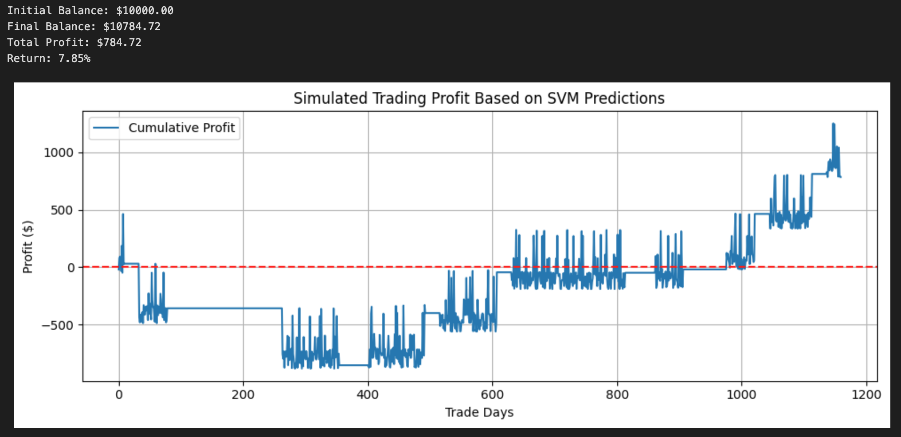
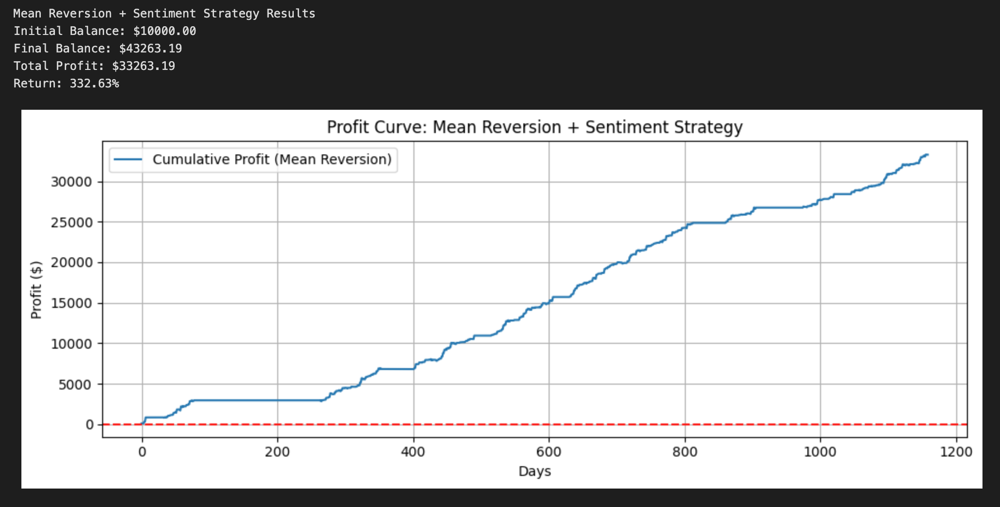

# Sentiment-Driven Stock Movement Prediction (Academic Project)

**University:** UTS - Master of IT (Data Analytics)  
**Focus:** NLP (FinBERT) + Time-Series Classification  
**Scope:** Academic exploration - not a trading system or financial advice

## Overview

This project explores whether **news sentiment** can help predict **next-day stock price direction**.  
I use **FinBERT** to score news text and train a simple classifier to predict whether `Close[t+1] > Close[t]`.

## Key Ideas

- **Sentiment feature:** Average FinBERT sentiment per day (`Avg_Sentiment`)
- **Target:** Binary label for next-day up/down move
- **Models:** Logistic Regression / SVM on sentiment (plus a simple price-only or naive baseline)
- **Evaluation:** Accuracy, confusion matrix; a brief cost-free PnL illustration for intuition

> ✱ This is an **academic project**. Results are illustrative and **exclude** transaction costs, slippage, and production-grade backtesting.

## Data & Labels

- Financial news aligned to trading dates
- Daily OHLC prices for selected tickers
- Label definition: `Target = 1 if Close[t+1] > Close[t] else 0`

## Method (Short)

1. **Sentiment extraction:** Run FinBERT on news headlines/articles; aggregate to a daily score.
2. **Features:** `Avg_Sentiment` (optionally simple price signals for a baseline).
3. **Temporal split:** Chronological split (no shuffling) to mimic “future” evaluation.
4. **Modeling:** Train classifier(s); compare against naive and price-only baselines.
5. **Evaluation:** Report classification metrics and a simple, cost-free PnL curve.

## Results (Example Summary)

- Sentiment-only model modestly beats a naive baseline on the held-out period.
- Gains are sensitive to split and thresholds; without costs, results may be optimistic.

### SVM Predictions (Sentiment-only)

### Mean Reversion + Sentiment Strategy

## Limitations

- No explicit **transaction costs**, **slippage**, or **position sizing**
- Simplified validation (single chronological split; no walk-forward)
- Coverage/alignment noise: not all relevant news is captured

**Project delivered by Mateusz Wichtowski (UTS, Master of IT — Data Analytics)**

